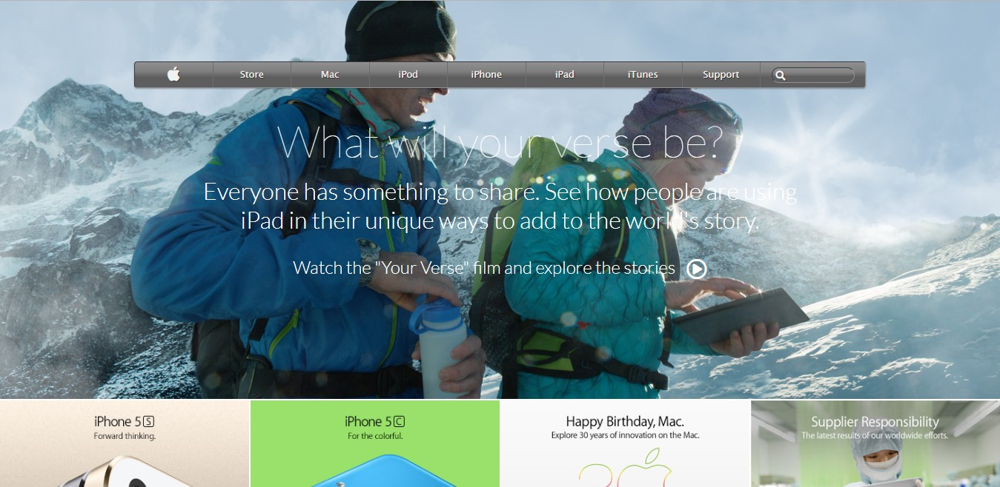

# Project Name
Apple Old Website Clone Page

## Table of contents
* [General info](#general-info)
* [Screenshots](#screenshots)
* [Technologies](#technologies)
* [Setup](#setup)
* [Features](#features)
* [Status](#status)
* [Inspiration](#inspiration)
* [Contact](#contact)

## General info
The purpose of this project is to make a clone of the <a href="https://web.archive.org/web/20140301004610/http://www.apple.com/">Apple Web Page</a>.

## Screenshots

## Technologies
* HTML5
* CSS3

## Setup
This project is built with the basic web page structures and styling. It is pretty simple to setup. All you have to do is to clone the project into your local repository.
Find attached below a preview of the project:  
<a href="https://raw.githack.com/adaorachi/apple-page/master/index.html">Apple Web Page</a>

## Features
List of features ready and TODOs for future development
* I do not have any future or TODO development for now. I will definitely give out a notice should I decide to.

## Status
The project is currently finished.

## Inspiration
The inspiration for this project was gotten from <a href="https://web.archive.org/web/20140301004610/http://www.apple.com/">Apple Web Page</a>. I enjoyed building this project.

## Contact
Created by [@MaryAnn Chukwuka](https://github.com/adaorachi) - feel free to contact me!
